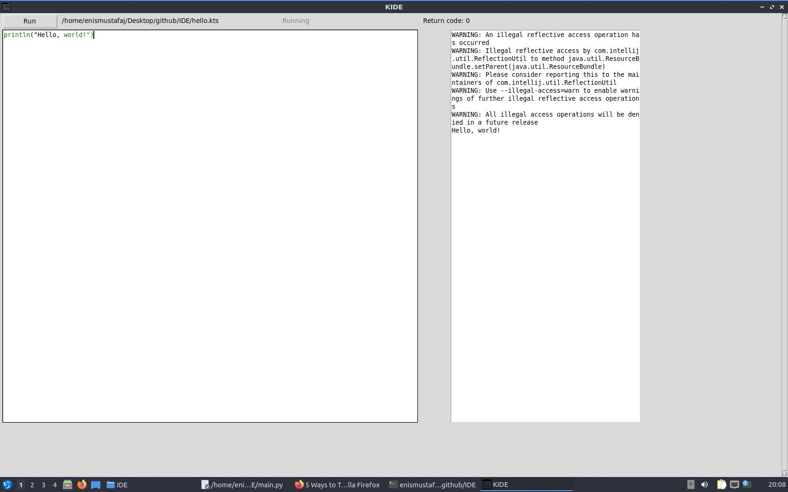

# KIDE
A simple Integrated Development Environment for Kotlin scripts.
#### Design
The User Interface consists of:
* The editor pane where the code is written
* The output pane where the result od the executed code is displayed
* Run Button which executes the code
* The status of the execution
* The return code

#### Functionality
The code which needs to be executed is entered in the editor pane. The code will be highlighted, keywords will be blue and the function calls will be green. When the code is executed, the progra will check if the file is saved. If this is not the case, the file must be saved first and then it is executed. The IDE will create a child process which will run the command ``` foo@bar:~$kotlinc -script file.kts ``` and the standard output and the standard error are piped to the IDE and then are displayed in the output pane. The error locations displayed in the output pane are underlined and red. If they are clicked, the cursor will be redirected to that specific position.

#### Requirements
Kotlin compiler and Python 3 are required to run and make the IDE work.

#### Screenshots

